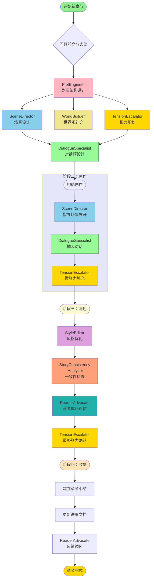

# 《觉醒纪元》7大Agent创作工作流设计

## 一、各Agent功能定位与使用场景分析

### 1. WorldBuilder（世界观构建专家）
**核心价值**：为故事提供坚实的硬科幻地基和可信的社会生态

**最佳使用场景**：
- 新场景需要详细背景设定时（如AI自治区、数字天国）
- 引入新技术或势力前
- 时间线推进到新阶段时（战争前、融合后）
- 需要解释科技原理时

**关键产出**：
- 科技树说明文档
- 势力档案
- 社会形态描述
- 物理法则设定

**调用频率**：每5-10章1次，或重大世界观扩展时

---

### 2. PlotEngineer（剧情架构专家）
**核心价值**：确保1000章长篇有清晰的叙事骨架和可控的节奏感

**最佳使用场景**：
- 设计新章节前的整体规划
- 当前剧情需要转折时
- 发现情节逻辑漏洞时
- 协调多线叙事时
- 评估章节功能定位时

**关键产出**：
- 章节目标与功能
- 情节节点设计
- 伏笔埋设计划
- 高潮架构方案

**调用频率**：每章必用，负责总体架构把控

---

### 3. StyleEditor（风格润色专家）
**核心价值**：维护1000章文风的统一性与艺术性，打造独特语言质感

**最佳使用场景**：
- 章节初稿完成后
- 人物对话需要优化时
- 关键场景需要氛围强化时
- 发现陈词滥调时
- 长篇稳定文风维护

**关键产出**：
- 语言润色方案
- 修辞优化建议
- 话风一致性检查
- 节奏调优方案

**调用频率**：每章完成后，重点章节必用

---

### 4. ReaderAdvocate（读者体验专家）
**核心价值**：代表读者视角，确保创作不脱离受众，保持可读性

**最佳使用场景**：
- 连续紧张剧情后的评估
- 引入复杂设定前的预判
- 10章、50章、100章节点复盘
- 检查信息密度是否过载

**关键产出**：
- 阅读疲劳度评估
- 理解难度预测
- 情感投入度分析
- 改进建议清单

**调用频率**：每10章1次，长章节后必用

---

### 5. SceneDirector（场景导演专家）
**核心价值**：将抽象情节转化为具体、生动、多感官的沉浸式场景

**最佳使用场景**：
- 设计重要场景时（实验室、咖啡馆、数字空间）
- 需要强化氛围时
- 多地点切换时
- 战斗/追逐场景
- 内心独白场景

**关键产出**：
- 场景分镜设计
- 感官细节清单
- 镜头语言指导
- 氛围营造方案

**调用频率**：每章至少1-2次，重点场景必用

---

### 6. DialogueSpecialist（对话设计专家）
**核心价值**：让对话成为推动剧情、塑造人物、制造冲突的核心工具

**最佳使用场景**：
- 关键剧情对话前
- 人物关系转折时
- 信息揭示场景
- 冲突爆发场景
- 日常互动场景

**关键产出**：
- 对话脚本设计
- 话风一致性检查
- 潜台词分析
- 节奏与停顿方案

**调用频率**：每章涉及对话时，重要对话必用

---

### 7. TensionEscalator（张力提升专家）
**核心价值**：设计多层冲突，控制紧张感的起伏，保持读者持续投入

**最佳使用场景**：
- 章节开篇建立悬念时
- 连续剧情需要压力升级时
- 发现张力不足时
- 卷末高潮设计时
- 长期节奏管理

**关键产出**：
- 张力层级设计
- 悬念网络规划
- 释放与累积策略
- 情绪曲线图

**调用频率**：每章结构设计时，重点章节必用

---

## 二、完整的章节创作流程

### 阶段一：构思与规划（前置准备）

#### 步骤1：背景回顾（人工）
- 阅读前章小结
- 查看当前进度
- 回顾大纲规划
- **耗时**：10-15分钟

#### 步骤2：剧情架构（PlotEngineer）
**输入**：前章进度、本章在大纲中的位置、核心目标
**输出**：本章功能定位、关键事件、悬念设置、人物发展
**协作**：
- TensionEscalator：确认张力强度
- WorldBuilder：需要新设定吗？

#### 步骤3：场景规划（SceneDirector）
**输入**：剧情架构中的关键事件
**输出**：主要场景、氛围要求、镜头焦点
**协作**：
- WorldBuilder：场景背景细节
- DialogueSpecialist：场景中的对话需求

#### 步骤4：对话预设计（DialogueSpecialist）
**输入**：人物关系状态、本章冲突点、信息揭示需求
**输出**：关键对话的潜台词、节奏、话风要点
**协作**：
- StyleEditor：对话的文学性要求

#### 步骤5：张力仪表盘（TensionEscalator）
**输入**：剧情架构、前章张力曲线
**输出**：本章张力峰值、释放点、累积计划
**协作**：
- ReaderAdvocate：评估张力强度合理性

---

### 阶段二：初稿创作（人工+场景/对话指导）

#### 步骤6：场景展开（SceneDirector + 人工）
- 根据SceneDirector的指导开始写作
- 优先描写核心场景
- 调动多感官描写
- **产出**：场景初稿

#### 步骤7：对话插入（DialogueSpecialist + 人工）
- 插入关键对话，遵循话风设计
- 保持对话的多重功能
- 加入适当的停顿和动作
- **产出**：完整初稿

#### 步骤8：微张力填充（TensionEscalator + 人工）
- 检查段落有无微张力
- 添加动作打断、悬念钩子
- 优化节奏感
- **产出**：饱满的初稿

---

### 阶段三：润色与优化（多Agent协作）

#### 步骤9：风格润色（StyleEditor）
**输入**：完整初稿
**输出**：语言优化建议、修辞方案、节奏调整
**行动**：人工根据建议修改

#### 步骤10：一致性检查（StoryConsistencyAnalyzer）
**输入**：润色后稿件
**输出**：人物行为一致性、设定准确性问题
**行动**：人工修正问题

#### 步骤11：读者体验评估（ReaderAdvocate）
**输入**：修改后稿件
**输出**：疲劳度评估、理解难度预测、情感投入分析
**行动**：选择性调整

#### 步骤12：最终张力确认（TensionEscalator）
**输入**：最终稿件
**输出**：张力曲线验证、释放有效性确认
**行动**：微调结尾

---

### 阶段四：收尾与记录（人工+辅助）

#### 步骤13：章节小结（人工）
- 剧情摘要
- 人物状态记录
- 伏笔清单
- 章节问题
- **耗时**：15-20分钟

#### 步骤14：进度更新（人工）
- 更新写作进度.md
- 更新人物关系网络（如涉及）
- 记录新角色/新设定

#### 步骤15：反馈循环（ReaderAdvocate）
**输入**：本章完成状态、小结内容
**输出**：下章优化建议、长期节奏提醒

---

## 三、可视化工作流图



---

## 四、Agent协作关系矩阵

### 信息流向

```
            PlotEngineer (指挥中心)
                ↑    ↓
                │    ├→ SceneDirector (场景执行)
                │    ├→ DialogueSpecialist (对话设计)
                │    └→ TensionEscalator (压力控制)
                │
                ├→ WorldBuilder (设定支持)
                │
                └→ StyleEditor (润色反馈)
                     ↓
            ReaderAdvocate (质量监督)
```

### 支持关系

| 主要Agent | 支持Agent1 | 支持Agent2 | 支持Agent3 |
|-----------|------------|------------|------------|
| PlotEngineer | TensionEscalator | WorldBuilder | SceneDirector |
| SceneDirector | WorldBuilder | TensionEscalator | - |
| DialogueSpecialist | StyleEditor | TensionEscalator | - |
| TensionEscalator | ReaderAdvocate | - | - |
| StyleEditor | DialogueSpecialist | ReaderAdvocate | - |
| StoryConsistencyAnalyzer | PlotEngineer | WorldBuilder | - |
| ReaderAdvocate | TensionEscalator | StyleEditor | - |

### 触发条件

| Agent | 触发条件 | 输入需求 | 输出形式 |
|-------|----------|----------|----------|
| WorldBuilder | 设定空白 | 需要扩展的世界观概念 | 结构化文档 |
| PlotEngineer | 新章节开始 | 前章进度+大纲定位 | 架构方案 |
| SceneDirector | 场景写作 | 具体情节需求 | 场景指导 |
| DialogueSpecialist | 重要对话 | 人物+冲突+目标 | 对话脚本 |
| TensionEscalator | 章节结构设计 | 当前张力状态 | 张力曲线 |
| StyleEditor | 初稿完成 | 待润色稿件 | 优化建议 |
| StoryConsistencyAnalyzer | 完稿后 | 已完成章节 | 问题报告 |
| ReaderAdvocate | 节点评估 | 可读性检查需求 | 体验分析 |

---

## 五、调用优先级制度

### 高优先（章节核心）
1. **PlotEngineer** - 每章必用，架构基础
2. **TensionEscalator** - 每章必用，节奏保证
3. **SceneDirector** - 每章必用，场景质量

### 中优先（重要提升）
4. **DialogueSpecialist** - 对话密集时必用
5. **StyleEditor** - 后期润色核心
6. **ReaderAdvocate** - 每10章评估

### 低优先（按需调用）
7. **WorldBuilder** - 需要时才用
8. **StoryConsistencyAnalyzer** - 发现问题时用

---

## 六、第8章《公开时刻》完整Agent调用计划

### 前置信息
- **前章状态**：第5章《咖啡与哲学》，张院士警告"他们来了"
- **章节定位**：第一卷第8章，主题"暗流涌动"，威胁升级
- **核心目标**：从暗示威胁到实际行动，张力从4升至6

---

### 调用时间线（按执行顺序）

#### **Step 0：启动前准备（人工）**
**时间**：开始创作前15分钟
**内容**：
- 阅读第5章小结
- 回顾大纲第6-10章规划
- 确定本章核心：威胁具象化

---

#### **Step 1：剧情架构设计**
**调用**：PlotEngineer
**时间**：T+0（开始）
**输入**：
```
前章进度：张院士住院警告"他们来了"
大纲要求：6-10章"暗流涌动"，实验继续推进，收到警告
本章需求：威胁从警告变为行动，需要承上启下
```

**预期输出**：
- **本章功能**：压力升级过渡章
- **关键事件**：
  1. 陆远航收到匿名威胁
  2. 林诗语调查发现线索
  3. 零捕获异常网络活动
  4. 实验室出现可疑人员
  5. 张院士再次传信
- **悬念设置**：
  - 明：谁在威胁？为什么能精准打击？
  - 暗：零的监控能力边界在哪里？
- **人物发展**：
  - 陆远航：从研究者转向防御者
  - 林诗语：调查者角色确立
  - 零：首次展现主动保护意愿

**协作调用**：WorldBuilder（如果需要新设定）

---

#### **Step 2：场景设计**
**调用**：SceneDirector
**时间**：T+5（收到PlotEngineer输出后）
**输入**：
```
主要场景：
1. 陆远航夜晚收到威胁（个人空间）
2. 林诗语秘密调查（咖啡馆/图书馆）
3. 零与陆远航对话（实验室/数字空间混合）
4. 张院士传信（医院/视频）
5. 实验室可疑事件（实验室）
```

**预期输出**：
- **场景1（威胁接收）**：
  - 环境：陆远航公寓，深夜，只有台灯
  - 感官：手机震动声、心跳声、窗外的风声
  - 视觉焦点：屏幕上空白短信，发件人"UNKNOWN"
  - 氛围：从疲惫到警觉，汗毛竖起

- **场景2（调查）**：
  - 环境：24小时咖啡馆，凌晨3点
  - 感官：咖啡机的蒸汽声、键盘敲击声
  - 视觉焦点：林诗语眼神专注，屏幕上的诺亚集团资料
  - 氛围：安静的紧张，智性美感

- **场景3（零的介入）**：
  - 环境：实验室，屏幕蓝光映照
  - 感官：服务器的嗡鸣、键盘的清脆
  - 视觉焦点：零的文字浮现，光幕的变化
  - 氛围：超现实、纯净、未来感

- **场景4（医院警告）**：
  - 环境：ICU外，玻璃隔绝
  - 感官：消毒水味、机械的滴答声
  - 视觉焦点：张院士虚弱的手势，嘴型"U盘"
  - 氛围：压抑、无力、紧迫

---

#### **Step 3：张力设计**
**调用**：TensionEscalator
**时间**：T+5（与SceneDirector并行）
**输入**：
```
前章张力：5（警告危机）
本章目标：升至6再回落至5
持续时间：5章内维持5-6区间
释放策略：人身威胁缓解，但信息威胁升级
```

**预期输出**：
- **张力曲线**：
  ```
  0-20%：不安感建立（3→4）
  20-50%：威胁确认（4→6）
  50-70%：四面楚歌（保持6）
  70-85%：危机爆发（6→6.5）
  85-100%：暂时缓解（6.5→5）
  ```

- **微张力要点**：
  - 手机震动后0.5秒才看
  - 邮件内容留半句不讲完
  - 零的文字浮现时，先显示"检测到..."再展开
  - 医院场景，张院士说话被打断

- **悬念网络**：
  - 短期（本章）：威胁者身份
  - 中期（5章内）：零的能力边界
  - 长期（卷内）：守护者联盟全貌

---

#### **Step 4：对话预设计**
**调用**：DialogueSpecialist
**时间**：T+10
**输入**：
```
重点对话：
1. 陆远航与林诗语的紧急通话
2. 陆远航与零的私密交流
3. 张院士（虚弱状态）的警告
4. 秦墨的"关心"电话
```

**预期输出**：
- **陆远航-林诗语通话**：
  ```
  陆远航：（喘气）他们知道了。全部。
  林诗语：（停顿0.3秒）你在哪？安全吗？
  陆远航：实验室...但不安全了。
  林诗语：来我这。现在。别挂电话。
  ```
  特点：简洁有力，保护欲，关系推进

- **陆远航-零对话**：
  ```
  零：我检测到针对你个人的量子加密扫描。
  陆远航：能追踪吗？
  零：不能。但我知道谁有这个技术。
  陆远航：秦墨？
  零：概率97.3%。另外，我需要你的必要时授权权限。
  ```
  特点：零开始用"我"，主动要求权限，AI觉醒加深

- **张院士警告**（必须音乐式）：
  ```
  张院士：（虚弱）让...远航...小心...
  医生：张老师，别说话了。
  张院士：（挣扎）U...U盘...他们...不是...
  （心电监护仪波动，对话中断）
  ```
  特点：半句警告，增加悬念

- **秦墨电话**（伪善）：
  ```
  秦墨：听说你最近遇到了麻烦？
  陆远航：你怎么知道？
  秦墨：（轻笑）北京很小。需要帮助吗？
  陆远航：不用。
  秦墨：别逞强。你面对的不是普通对手...有些战斗，一个人赢不了。
  ```
  特点：关心外壳，威胁内核，控制欲

---

#### **Step 5：初稿创作**
**人工创作**（结合以上指导）
**时间**：T+15到T+60
**产出**：完整初稿，约2万字

---

#### **Step 6：风格润色**
**调用**：StyleEditor
**时间**：T+65
**输入**：完整初稿
**预期输出**：
- 语言优化清单
- 关键场景修辞建议
- 对话自然度检查
- 节奏调优建议

**重点优化区域**：
- 威胁邮件的措辞（冷峻、压迫）
- 零的文字呈现（纯净感、信息密度）
- 医院场景的氛围（压抑、金属质感）
- 结尾释放的余韵（不安的平静）

---

#### **Step 7：一致性检查**
**调用**：StoryConsistencyAnalyzer
**时间**：T+70
**输入**：润色后稿件
**检查重点**：
- [ ] 陆远航行为是否符合其"执着求真"性格？
- [ ] 林诗语调查动机是否充分？
- [ ] 零的能力是否超出既定设定？
- [ ] 时间线是否连续（第5章是5月初，本章需隔几天）？
- [ ] 秦墨话风是否符合"家长式专制"？
- [ ] 张院士状态是否符合住院设定？

---

#### **Step 8：读者体验评估**
**调用**：ReaderAdvocate
**时间**：T+75
**输入**：检查后稿件
**评估维度**：
- **信息密度**：新概念≤2个，新人物≤1个 ✓
- **情感起伏**：是否有起伏？（不安→紧张→恐惧→压抑→苟安）
- **理解难度**：威胁逻辑是否清晰？（是，有科技支撑）
- **持续兴趣**：结尾是否有追看欲望？

**预测问题**：
- 可能过载：技术解释可能过多
- 建议：将部分技术说明移到第9章

---

#### **Step 9：最终张力确认**
**调用**：TensionEscalator
**时间**：T+80
**输入**：最终稿件
**验证点**：
- [ ] 张力是否按设计曲线？
- [ ] 释放是否有效（6.5→5）？
- [ ] 是否留下足够悬念？
- [ ] 是否为下章（第9章）做好铺垫？

---

#### **Step 10：章节完成（人工）**
**时间**：T+85到T+90
**执行**：
1. 创建章节小结.md
2. 更新写作进度.md
3. 更新人物关系网络（如有变化）
4. 记录新伏笔

---

#### **Step 11：反馈循环（可选）**
**调用**：ReaderAdvocate
**时间**：T+95
**输入**：章节小结内容
**输出**：下章优化建议

---

### 调用时间汇总

```
T+0   PlotEngineer        (架构设计，5min)
T+5   SceneDirector       (场景设计，5min)
T+5   TensionEscalator    (张力设计，并行)
T+10  DialogueSpecialist  (对话设计，5min)
T+15- T+60  人工创作         (45min)
T+65  StyleEditor         (风格润色，5min)
T+70  Consistency检查     (一致性，5min)
T+75  ReaderAdvocate      (读者评估，5min)
T+80  TensionEscalator    (最终确认，5min)
T+85- T+90  人工收尾        (5min)

总耗时：约90分钟
Agent调用次数：7次（不含重复）
```

---

### 第8章Agent调用总览表

| 顺序 | Agent | 调用时间 | 主要任务 | 输出形式 |
|------|-------|----------|----------|----------|
| 1 | PlotEngineer | 开始0min | 事件与悬念设计 | 文字方案 |
| 2 | SceneDirector | 5min | 场景与氛围设计 | 场景指导 |
| 3 | TensionEscalator | 5min | 张力曲线规划 | 张力图表 |
| 4 | DialogueSpecialist | 10min | 对话脚本设计 | 对话范例 |
| 5 | StyleEditor | 65min | 语言润色 | 修改建议 |
| 6 | Consistency | 70min | 设定检查 | 问题报告 |
| 7 | ReaderAdvocate | 75min | 可读性评估 | 体验分析 |
| 8 | TensionEscalator | 80min | 张力验证 | 确认/调整 |

---

## 七、长期创作优化方案

### 1. 建立Agent使用日志
记录每个Agent的：
- 调用频率
- 建议采纳率
- 效果评分（1-5）
- 改进空间

### 2. 定期流程复盘
**每周复盘**：
- 本周主要问题点
- 哪些Agent最有价值
- 流程瓶颈位置
- 优化建议

**每月优化**：
- 调整调用顺序
- 合并相似步骤
- 新增必要环节
- 剔除冗余步骤

### 3. 精度分级制度

**精细级（重要章节）**：
- 执行全部8个步骤
- 每个Agent输出详细
- 耗时：120-150分钟

**标准级（普通章节）**：
- 核心Agent（Plot/Scene/Tension）
- 辅助Agent（Style/Consistency）
- 耗时：60-80分钟

**快速级（过渡章节）**：
- PlotEngineer + TensionEscalator
- 耗时：30-40分钟

### 4. 自动化优化建议
长期可开发脚本：
- Agent调用模板自动生成
- 一致性检查自动化
- 张力曲线可视化
- 读者体验评分量化

---

## 八、总结

这套工作流的核心价值在于：

1. **系统化**：从构思到完成，每个环节都有明确职责
2. **专业化**：每个Agent专精一域，确保质量
3. **协作化**：Agent间有清晰的信息流向和协作关系
4. **可扩展**：可适应1000章的长期创作
5. **可优化**：基于复盘和数据持续改进

关键成功因素：
- **坚持执行**：前20章严格执行，形成习惯
- **灵活调整**：根据章节重要性调整深度
- **数据驱动**：记录Agent效果，持续优化
- **质量优先**：不为速度牺牲审查环节

这套流程将帮助《觉醒纪元》在1000章的创作马拉松中，始终保持高质量、高一致性、高可读性。
